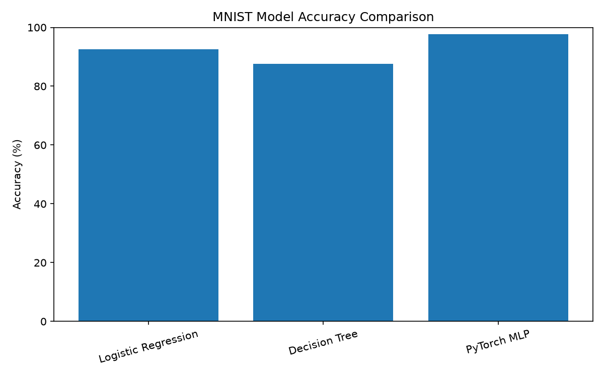
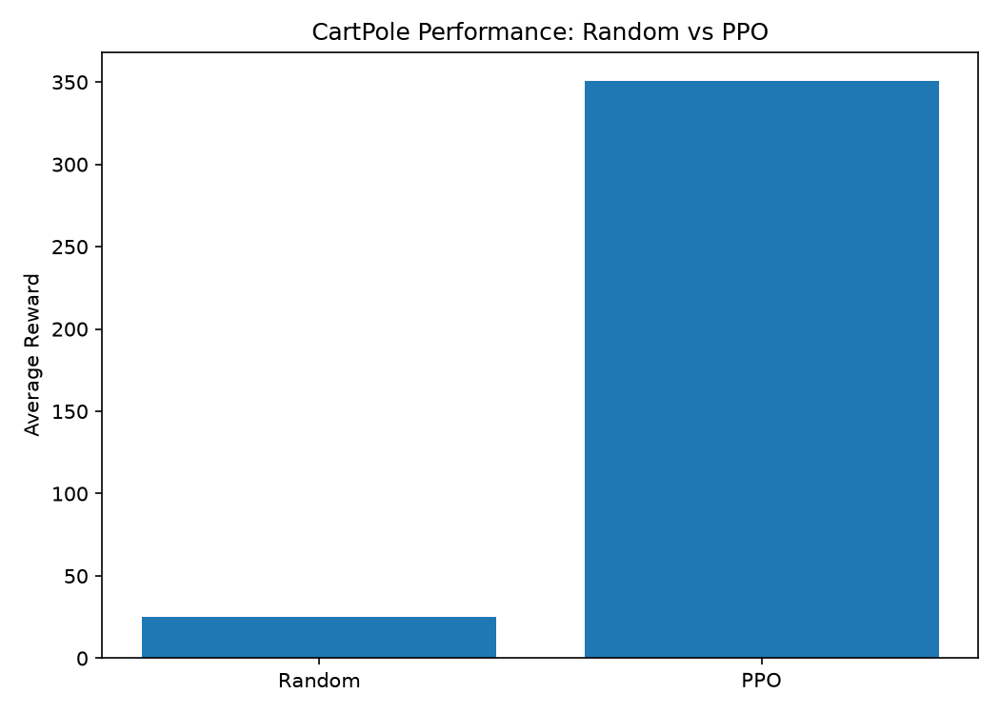

# ML & Robotics Portfolio

A practical AI/ML learning portfolio progressing from Python fundamentals to machine learning, neural networks, and reinforcement learning, with a long-term focus on AI and robotics research.

## Projects

### 1. MNIST Digit Classification — Perception

Built and compared multiple approaches for handwritten digit classification using the MNIST dataset.

**Approaches:**

* Logistic Regression — scikit-learn
* Decision Tree — scikit-learn
* Multi-Layer Perceptron (MLP) — PyTorch

**Test Accuracy:**

| Model               | Accuracy |
| ------------------- | -------: |
| Logistic Regression |   92.57% |
| Decision Tree       |   87.54% |
| PyTorch MLP         |   97.64% |

The PyTorch MLP achieved the best performance among the tested models.

### MNIST Results



### 2. CartPole Reinforcement Learning — Control

Started with reinforcement learning fundamentals using Gymnasium, then trained an agent using Proximal Policy Optimization (PPO) with Stable-Baselines3.

**Progression:**

`Random Actions → RL Interaction Loop → PPO Learned Policy`

**Evaluation:**

Average reward over 10 evaluation episodes:

| Agent          | Average Reward |
| -------------- | -------------: |
| Random Actions |           25.0 |
| PPO            |          350.8 |

The PPO agent achieved substantially higher average reward than the random-action baseline, with several evaluation episodes reaching the CartPole maximum reward of 500.

### CartPole Results



## AI/Robotics Progression

The portfolio is organized around three stages:

**Perception** → MNIST image classification

**Decision** → Reinforcement learning with CartPole

**Control** → Future robotics projects

The long-term goal is to apply these foundations to robotics by combining machine learning, perception, decision-making, and control.

## Tech Stack

* Python
* NumPy
* Pandas
* Matplotlib
* scikit-learn
* PyTorch
* torchvision
* Gymnasium
* Stable-Baselines3
* Git & GitHub

## Repository Structure

```text
ml-robotics-portfolio/

├── week1/
│   └── day1_variables.py
├── week2/
│   ├── numpy_intro.py
│   ├── matplotlib_intro.py
│   ├── pandas_intro.py
│   └── mnist_intro.py
├── week3/
│   ├── baseline_model.py
│   └── model.pkl
├── week4/
│   ├── pytorch_intro.py
│   └── mnist_model.pth
├── week5/
│   └── cartpole_intro.py
├── week6/
│   ├── ppo_cartpole.py
│   ├── ppo_cartpole_test.py
│   └── ppo_cartpole.zip
├── results/
│   ├── cartpole_performance.png
│   ├── create_charts.py
│   └── mnist_model_comparison.png
├── requirements.txt
└── README.md
```

## How to Run

Clone the repository and create a virtual environment:

```bash
git clone https://github.com/bless15/ml-robotics-portfolio.git

cd ml-robotics-portfolio

python -m venv .venv
```

Activate the virtual environment and install the dependencies:

```bash
pip install -r requirements.txt
```

Individual Python files can then be run from their respective week directories.

## Learning Roadmap

* Week 1 — Python Fundamentals + Git Basics
* Week 2 — Python for Data + MNIST Exploration
* Week 3 — Classical Machine Learning
* Week 4 — Neural Networks with PyTorch
* Week 5 — Reinforcement Learning Fundamentals
* Week 6 — PPO Reinforcement Learning
* Week 7 — Portfolio Polish
* Week 8 — Buffer + Stretch Goals

## Future Direction

Planned progression toward robotics-focused AI research:

* Computer Vision
* Robotics Perception
* Robot Control
* Simulation
* Sim-to-Real Learning
* Reinforcement Learning for Robotics

## Author

Joseph Joy
